**2021-2022学年第二学期**

**实验报告**


- 课程名称:编程语言原理与编译

- 实验项目: 编译原理大作业：Micro C初实现

- 实验指导教师:郭鸣

- |  姓名  |   学号   |   班级   |
  | :----: | :------: | :------: |
  | 郑泽阳 | 31901063 | 计算1902 |

- 项目源代码:https://gitee.com/Shylock-patriot/microc

## 一、项目评价基本情况

### （一）成员贡献情况

|  姓名  |      任务      | 权重 |
| :----: | :------------: | :--: |
| 郑泽阳 | 编译器、解释器与测试 | 1 |

### （二）成员提交代码


### （三）项目自评等级

#### 1.解释器

| 词法           | 评分  | 备注 |
| -------------- | ----- | ---- |
| 注释 // /**/   | ⭐⭐⭐   |      |
| **语法**       |       |      |
| for 循环       | ⭐⭐⭐  |      |
| while循环      | ⭐⭐⭐   |      |
| dowhile循环    | ⭐⭐⭐|      |
| **语义**       |       |      |
| i++,i--,       | ⭐⭐⭐   |      |
| ++i,--i        | ⭐⭐⭐   |      |
| += -= *= /= %= | ⭐⭐⭐   |      |
| 三元运算符 ?:  | ⭐⭐⭐⭐ |      |

#### 2.编译器

| 词法语法           | 评分 | 备注 |
| ------------------ | ---- | ---- |
| break              | ⭐⭐⭐ |      |
| continue           | ⭐⭐⭐  |      |
| float类型          | ⭐⭐⭐⭐ |      |
| i++, ++i, i--, --i | ⭐⭐⭐  |      |
| += -= *= /= %=     | ⭐⭐⭐  |      |
| "左移"运算         | ⭐⭐   |      |
| "或"运算           | ⭐⭐   |      |
| "异或"运算         | ⭐⭐   |      |
| "取反"运算         | ⭐⭐   |      |

## 二、项目运行命令

#### 1.解释器

```bash
dotnet clean  interpc.fsproj     # 可选
dotnet build -v n interpc.fsproj # 构建./bin/Debug/net6.0/interpc.exe ，-v n查看详细生成过程
./bin/Debug/net6.0/interpc.exe example/ex1.c 8 # 执行解释器

```
```js
//dotnet "C:\Users\Jenos\.nuget\packages\fslexyacc\10.2.0\build\/fslex/netcoreapp3.1\fslex.dll"  -o "CLex.fs" --module CLex --unicode CLex.fsl
//dotnet "C:\Users\Jenos\.nuget\packages\fslexyacc\10.2.0\build\/fsyacc/netcoreapp3.1\fsyacc.dll"  -o "CPar.fs" --module CPar CPar.fsy
//dotnet run --project interpc.fsproj example/ex1.c 8
```

#### 2.编译器

```bash
dotnet clean  microc.fsproj     # 可选
dotnet build  microc.fsproj   # 构建 ./bin/Debug/net6.0/microc.exe
dotnet run --project microc.fsproj example/ex1.c    # 执行编译器，编译 ex1.c，并输出ex1.out 文件
javac Machine.java
java Machine ./example/ex1.out 3
```

## 三、测试

### （一）解释器

#### 1.注释

```c
// micro-C example 1
//dotnet run --project interpc.fsproj example/ex1.c 8
int g ;
int h[3] ;
void main(int n) {
  h[0] = 1;
  // h[4] = 5;
  // print h[3]; //数组首地址
  // print h[4]; //参数 n
  // h[5] = 5;
  // h[6] = 5;
  // h[7] = 5;
  // h[9] = 5;
  // h[10] = 5;
  // h[11] = 5;
  // h[12] = 5;
  // 数组越界，程序的行为会异常
  while (n > 0) {
    print n;
    n = n - 1;
  }
  println;
}
```

运行结果
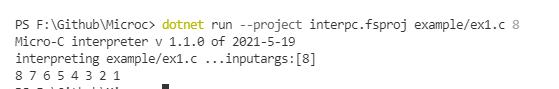

#### 2.while

```c
//dotnet run --project interpc.fsproj .\example\while.c  8
void main(int n ) {
    while(n){
     print n;
     n--;
    }
}
```

运行结果
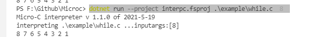


#### 3.for

```c
//dotnet run --project interpc.fsproj .\example\for.c  8  
void main(int n) {
  int i;
  for(i=0;i<n;i++){
    print i;
  }
}
```

运行结果
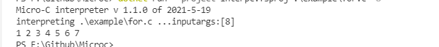

#### 4.dowhile

```c
//dotnet run --project interpc.fsproj .\example\dowhile.c  8
void main(int n ) {
    do{
     print n;
     n--;
    }while(n)
}
```

运行结果

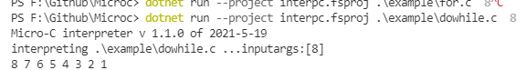

#### 5.+= -= *= /= %=

```c
//dotnet run --project interpc.fsproj .\example\_+=.c  8  
void main(int n) {
  print n;
  n+=3;
  print n;
  n-=4;
  print n;
  n*=3;
  print n;
  n/=2;
  print n;
  n%=2;
  print n;
}
```

运行结果
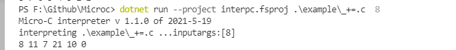

#### 6.i++ i-- ++i --i

```c
//dotnet run --project interpc.fsproj .\example\nPP.c  8
void main(int n) {
  n++;
  ++n;
  print n;
  n=10;
  n--;
  --n;
  print n;
}
```

运行结果

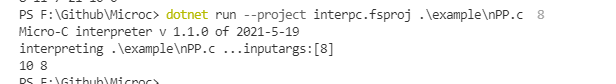

#### 7.三元运算符

```c
//dotnet run --project interpc.fsproj .\example\3operator.c  8
void main(int n) {
  int a;
  a=n?101:110;
  print a;
  println;
}
```

运行结果

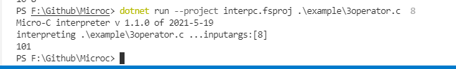

### （二）编译器

#### 1.break continue

##### （1）break

###### (1.1)测试代码

```c
//dotnet run --project microc.fsproj .\example\break_test.c 
//java Machine .\example\break_test.out 8
void main(int n) { 
  int i; 
  i=0; 
  while (i < 3) { 
    if (i == 1) {
        i = i + 2;
        print i;
         break;
    }
    print i; 
    i=i+1;
  } 
}
```

###### (1.2)运行

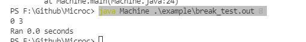
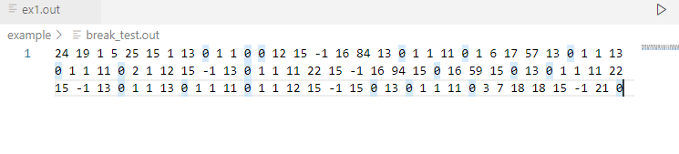
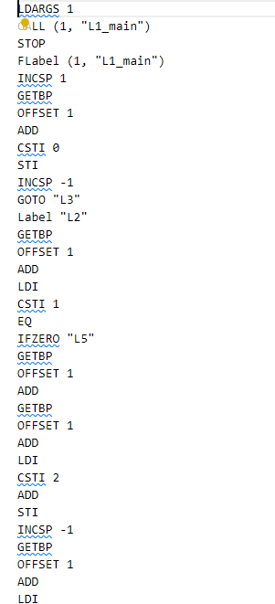

##### （2）continue

###### (2.1)测试代码

```c
//dotnet run --project microc.fsproj .\example\continue_test.c
//java Machine .\example\continue_test.out 8
void main(int n) { 
  int i; 
  i=0; 
  while (i < 3) { 
    if (i == 1) {
        i = i + 1;
        continue;
    }
    print i; 
    i=i+1;
  } 
}
```

###### (2.2)运行

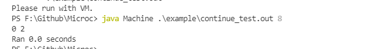
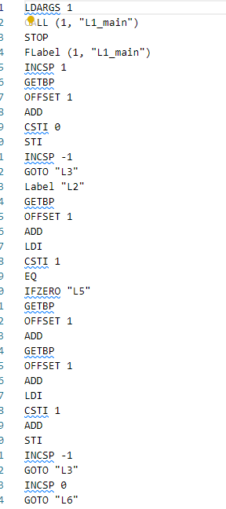
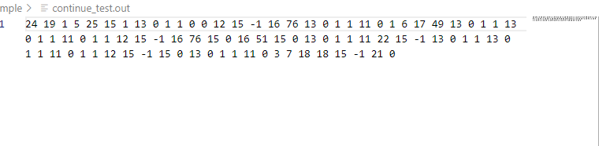

#### 2.~;<<;^;|; 


##### << 操作

###### 测试代码

```c
//dotnet build microc.fsproj 
//dotnet build microcc.fsproj  
//dotnet run --project microc.fsproj .\example\bit.c
//.\machine.exe .\example\bit.out
void main(int n) {
	int a;
	int b;
	int c;
	a = 1;
	b = 0;
// 	c = a&b;
//   print c;
// 	c = a|b;
//   print c;
    c = a << 2;
    print c;
//   c = c >> 1;
//   print c;
//   c = a ^ b;
//   print c;
//   c = ~b;
//   print c;
}
```

###### 运行


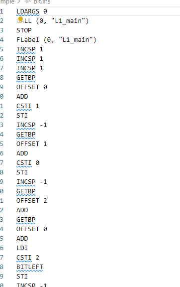
##### 异或操作 ^

###### 测试代码

```c
void main() {
	int a;
	int b;
	int c;
	a = 1;
	b = 0;
  c = a ^ b;
  print c;
}
```

###### 运行

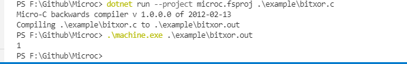
##### 或运算 |

###### 测试代码

```c
void main() {
	int a;
	int b;
	int c;
	a = 1;
	b = 0;
	c = a|b;
    print c;
}
```

###### 运行


#### 3.Float浮点数

##### (1)测试代码

```c
void main() { 
   float f;
   f = 1.2;
   print f;
}
```

##### (2)运行


#### 4.+=;-=;*=;/=*

##### （1）测试代码

```c
void main(int n) {
  n=10;
  print n;
  n+=3;
  print n;
  n-=4;
  print n;
  n*=3;
  print n;
  n/=2;
  print n;
  n%=2;
  print n;
}
```

##### （2）运行


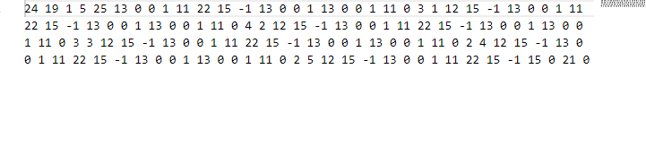
#### 5.i++;i--;++i;--i

##### (1)测试代码

```c
void main(int n) {
  n++;
  ++n;
  print n;
  n=10;
  n--;
  --n;
  print n;
}

```

##### (2)运行


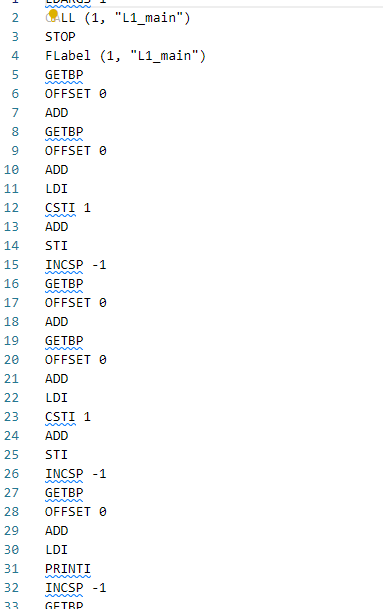

## 四、项目心得体会

### （一）项目开发过程心得
编译原理是一门很晦涩的学科，难度也很大，刚开始学习时基本上什么都看不懂，很难有信心坚持学下去，同时老师也推荐了很多课外需要看的书籍，对自学的要求很高。这个大作业刚开始时一脸懵的，无从下手的感觉，但询问了一些同学，终于开始自己的尝试。整个过程让我更理解抽象语法树，词法定义和语法定义的概念，比没做之前学到了很多。同时调试过程也很考研心态。虽然没有彻底理解，但也感受颇多。并没有完成特别多的功能，但也从中学到许多。

### （二）对本课程建议
感觉主要靠的自学偏多，同时资料很多，作用也比较大，但书本的作用就小很多了。
然后课程过程比较枯燥，虽然可能和学科本身性质有关系，但如果更有趣一点，可能会有更好的体验。

